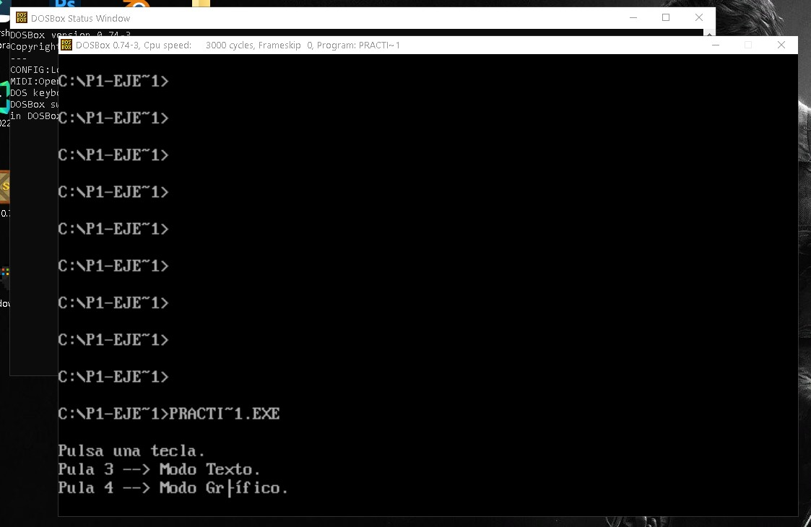
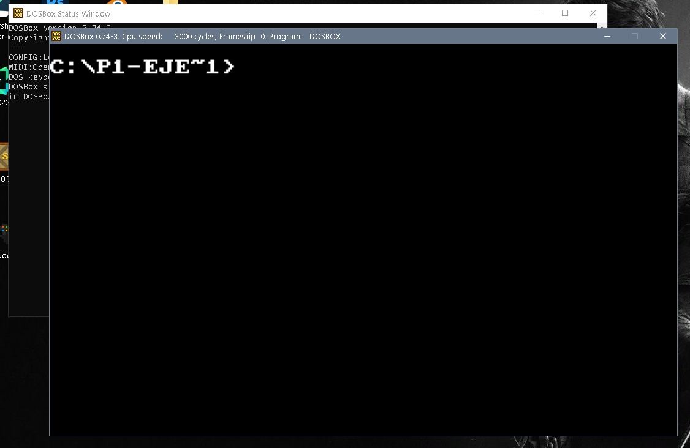
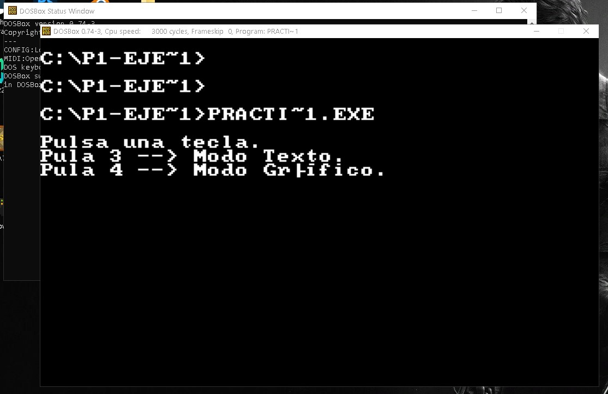
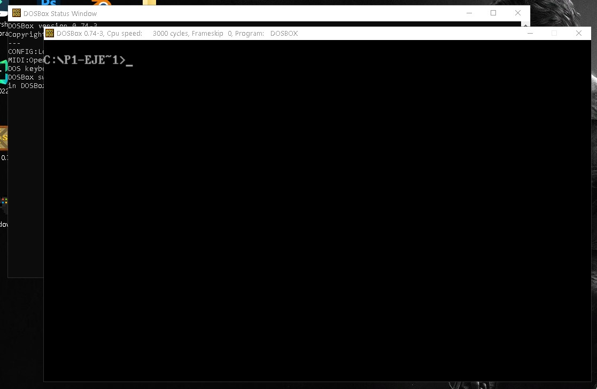
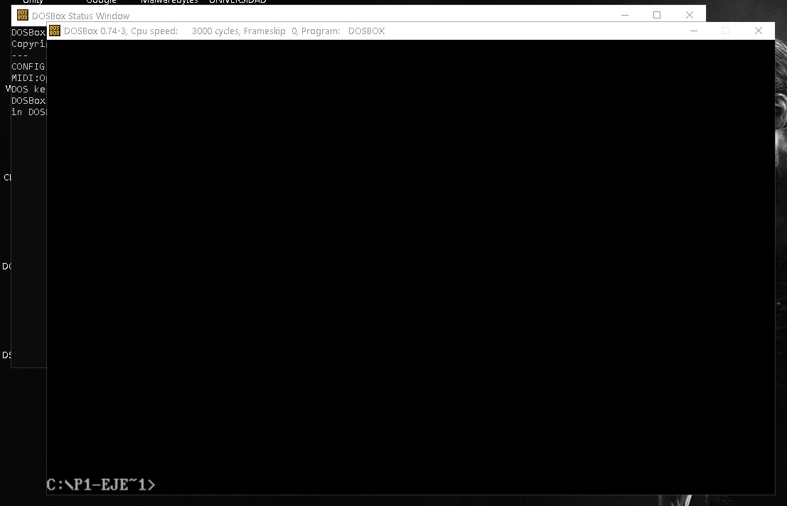
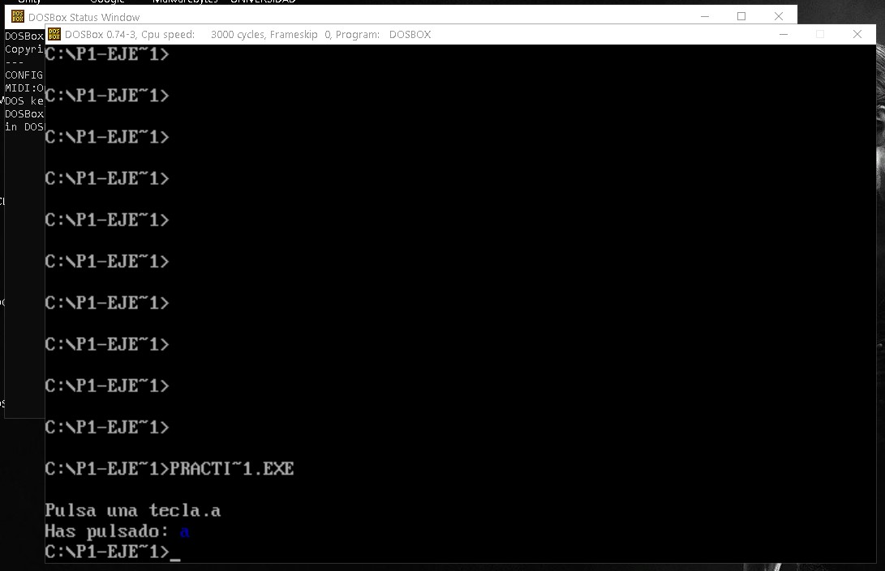
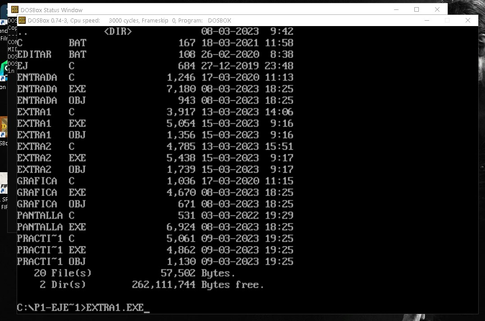
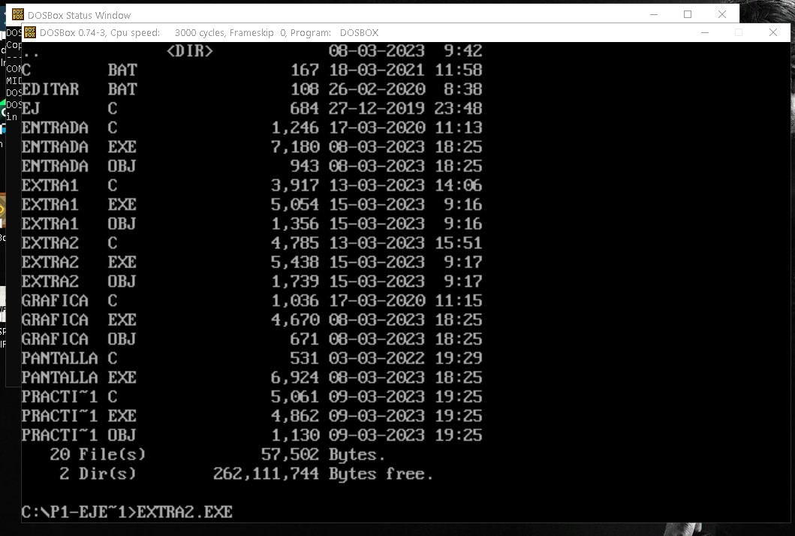
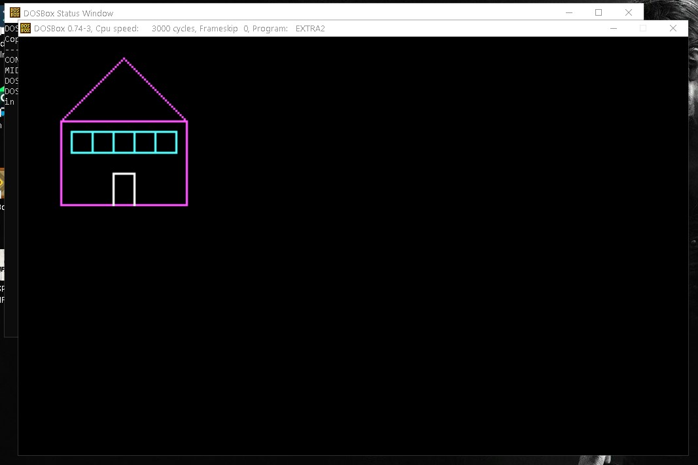

# Práctica 1: Entrada/Salida utilizando interrupciones con lenguaje C

## 1. Objetivos de la práctica

- Aprender la forma de uso y programación de interrupciones software desde programas de usuario.
- Comprender la interfaz que permite un sistema operativo para el acceso a los recursos de entrada/salida.
- Crear una librería de funciones básicas de Entrada/Salida a través de llamadas a interrupciones.

--------------------------

## 2. Introducción

### En esta práctica se va a acceder a las rutinas de servicio a interrupción de la BIOS para teclado y vídeo desde el sistema operativo MS-DOS. . Se va a utilizar el lenguaje de programación C para realizar interrupciones software a través de la función no estándar int86()

--------------------------

## 3. Requisitos Mínimos

### Realizar las siguientes 9 funciones

- ***gotoxy():*** coloca el cursor en una posición determinada.

- ***setcursortype():*** fijar el aspecto del cursor, debe admitir tres valores: INVISIBLE, NORMAL y GRUESO.

- ***setvideomode():*** fija el modo de video deseado.

- ***getvideomode():*** obtiene el modo de video actual.

- ***textcolor():*** modifica el color de primer plano con que se mostrarán los caracteres.

- ***textbackground():*** modifica el color de fondo con que se mostrarán los caracteres.

- ***clrscr():*** borra toda la pantalla.

- ***cputchar():*** escribe un carácter en pantalla con el color indicado actualmente.

- ***getche():*** obtiene un carácter de teclado y lo muestra en pantalla.

--------------------------

## 4. Requisitos Ampliados

- ***Implementar una función que permita dibujar un recuadro en la pantalla en modo texto.*** Recibirá como parámetros las coordenadas superior izquierda e inferior derecha del recuadro, el color de primer plano y el color de fondo.

- Implementar en lenguaje C un programa que establezca modo gráfico CGA (modo=4) ***para crear dibujos sencillos en pantalla***.

--------------------------

## Requisitos Mínimos

### - ***gotoxy():***

### Bien, en esta función lo que se nos pide que hagamos es que posicionemos el cursosr en una posición pasa como parámetro, al cual yo le he puesto x=10 y y=17

```
void gotoxy(int fil, int col){
 union REGS inregs, outregs;

 inregs.h.ah = 2;
 inregs.h.dh = fil;
 inregs.h.dl = col;
 inregs.h.bh = 0;
 int86(0x10, &inregs, &outregs);
}
```

*Resultado:*


--------------------------

### - ***setcursortype():***

### Esta función se encarga de cambiar el tipo de cursor que tenemos, podemos cambiarlo a Invisible, Normal y Grueso.

```
void setcursosrtype(int tipo_cursor){
    
    union REGS inregs, outregs;

    inregs.h.ah = 1;
    switch(tipo_cursor){
        case 0: // invisible
            inregs.h.ch = 010;
            inregs.h.cl = 000;
            break;
        case 1: // por fedecto
            inregs.h.ch = 010;
            inregs.h.cl = 010;
            break;
        case 2: // grueso
            inregs.h.ch = 000;
            inregs.h.cl = 010;
            break;
    }

    int86(0x10, &inregs, &outregs);

}
```

*Resultado:*


--------------------------

### - ***setvideomode():***

### Esta función se encarga de establecer el modo de video deseado, en nuestro caso hemos tomado 2 opciones, la de modo texto y gráfico, sabemos que hay mas variantes dentro de cada opción pero para hacerlo más simple hemos tomado las 2 opciones más importantes.

```
void setvideomode(BYTE modo){

    union REGS inregs, outregs;

    inregs.h.al = modo;
    inregs.h.ah = 0x00;
    int86(0x10, &inregs, &outregs);

}
```
*Resultado:*









--------------------------

### - ***getvideomode():***

### Esta función es lo contrario a la anterior, aqui te muestra en el modo de video en el que estás actualmente.

```
int getvideomode(){

    union REGS inregs, outregs;
    int modo;

    inregs.h.ah = 15;
    int86(0x10, &inregs, &outregs);

    modo = outregs.h.al;

    return modo;

}
```

*Resultado:*


--------------------------

### - ***textcolor():***

### Aqui lo que hacemos es establecer el colo de los caracteres, en este caso le he puesto el color rojo.

```
void textcolor(unsigned char _ctexto){

	ctexto = _ctexto;

}
```

*Resultado:*


--------------------------

### - ***textbackground():***

### En esta función nos encargamos de modificar el color del fondo de los caracteres, en este caso le he puesto un blanco.

```
void textbackground(unsigned char _cfondo){

	cfondo = _cfondo;

}
```

*Resultado:*


--------------------------

### - ***clrscr():***

### Esta función se encarga de borrar toda la pantalla, el truco de esta función es que tenemos una función que sirve para hacer scroll ya sea hacia arriba o hacia abajo, pero ponemos el valor de AH a 0 ésta pasará a borrar la zona delimitada en vez de hacer dicho scroll.

```
void clrscr(){

    union REGS inregs, outregs;

    inregs.h.ah = 0x06;
    inregs.h.al = 0;
    inregs.h.dh = 0x25;
    inregs.h.dl = 0x80;
    inregs.h.bh = 0x00;
    inregs.x.cx = 0x00;
    int86(0x10, &inregs, &outregs);

}
```

*Resultado:*




--------------------------

### - ***cputchar():***

### Esta función escribe un carácter y acto seguido lo muestra con el color que esté actualmente establecido, asique aquí tambien se tienen en cuenta las funciones: textcolor() y textbackground().

```
void cputchar(char letra){

    union REGS inregs, outregs;

    inregs.h.ah = 0x09;
    inregs.h.al = letra;
    inregs.h.bl = cfondo << 4 | ctexto;
    inregs.h.bh = 0x00;
    inregs.x.cx = 1;
    int86(0x10, &inregs, &outregs);
    return;
	
}
```

*Resultado:*


### Como se puede ver, ha escrito el carácter a con el color rojo de letra establecido antes y el color blanco de fondo también establecido antes.

--------------------------

### - ***getche():***

### Por última pero no más importante esta funcion lee una pulsación de teclado y lo muestra por pantalla.

```
int getche(){

    union REGS inregs, outregs;
    int caracter;

    inregs.h.ah = 1;
    int86(0x21, &inregs, &outregs);

    caracter = outregs.h.al;
    return caracter;

}
```

*Resultado:*



### ***ANOTACIÓN:*** *En el .c de la práctica se ha proporcionado el Main con dichas funciones usadas en los ejemplo para poder comprobar su correcto funcionamiento.*

--------------------------

## Requisitos Ampliados

### - ***Ejercicio extra 1:***

### En éste primer ejercicio extra se nos pide el crear una función que nos dibuje un cuadrado en el modo texto, a dicha función le pasaremos cómo parámetros las coordenadas superior izquierda e inferior derecha del recuadro y tambien el color de primer plano y el color de fondo.

***PintarCuadrado():***

```
void PintarCuadrado(int s_x, int s_y, int i_x, int i_y, unsigned char _color, unsigned char _fondo){

    char caracter = ' ';
    int i = 0;

    // Establecemos los colores
    textcolor(_color);
    textbackground(_fondo);

    // Nos movemos por el eje x y pintamos el lateral izquierdo
    for(i = s_x; i <= i_x; i++){
        gotoxy(i,s_y);
        cputchar(caracter);
    }

    // Nos movemos por el eje x y pintamos el lateral derecho
    for(i = s_x; i <= i_x; i++){
        gotoxy(i,i_y);
        cputchar(caracter);
    }

    // Nos movemos por el eje y y pintamos la parte de arriba
    for(i = s_y; i <= i_y; i++){
        gotoxy(s_y,i);
        cputchar(caracter);
    }
    
    // Nos movemos por el eje y y pintamos la parte de abajo
    for(i = s_y; i <= i_y; i++){
        gotoxy(i_y,i);
        cputchar(caracter);
    }

}
```
### Lo que yo he hecho es hacer 4 bucles for, los 2 primeros es para movernos por el eje X y e ir pintando los laterales del recuadro y los otros 2 for para movernos por el eje Y y dibujar la parte de arriba y de abajo.

### En el main básicamente he declarado los parámetros y asignados valores, tras eso llamo a la función que pinta el recuadro.

*Resultado:*




--------------------------

### - ***Ejercicio extra 2:***

### En el segundo ejercicio se nos pide el crear un dibujo y mostrarlo en modo gráfico. Ántes de mostrar el código de la función, hay que tener en cuenta el dato de implementar una función extra, que es la que nos servirá para pintar los pixeles de colores en el modo gráfico, la función nos viene implementada en el pdf asique es cuestión de hacerla en nuestro editor.

***pixel():***

```
void pixel(int x, int y, BYTE c){

    union REGS inregs, outregs;
    
    inregs.x.cx = x;
    inregs.x.dx = y;
    inregs.h.al = c;
    inregs.h.ah = 0x0C;

    int86(0x10, &inregs, &outregs);

}
```

***dibujo():***

```
void dibujo(){
    int i;

    setvideomode(4);

    // Techo
    // Derecha

    for(i = 10; i <= 40; i++){
        pixel(40+i,i,2);
    }

    // Izquierda

    for(i = 10; i <= 40; i++){
        pixel(60-i,i,2);
    }

    // Parte de abajo

    for(i = 10; i <= 70; i++){
        pixel(i+10,40,2);
    }

    // Base

    // Lateral izquierdo

    for(i = 10; i <= 50; i++){
        pixel(20,i+30,2);
    }    

    // Lateral derecho

       for(i = 10; i <= 50; i++){
        pixel(80,i+30,2);
    }  

    // Parte de abajo

    for(i = 10; i <= 70; i++){
        pixel(i+10,80,2);
    } 

    // Puerta

    // Lateral Izquierdo

    for(i = 0; i <= 15; i++){
        pixel(45,i+65,3);
    } 

    // Lateral Derecho

    for(i = 0; i <= 15; i++){
        pixel(55,i+65,3);
    } 

    // Parte de Arriba

    for(i = 0; i <= 10; i++){
        pixel(i+45,65,3);
    } 

    // Ventanal

    // Parte de Arriba
    
    for(i = 10; i <= 60; i++){
        pixel(i+15,45,1);
    } 

    // Parte de abajo

    for(i = 10; i <= 60; i++){
        pixel(i+15,55,1);
    } 

    // Lateral Izquierdo

    for(i = 0; i <= 10; i++){
        pixel(25,i+45,1);
    }

    // Lateral Derecho

    for(i = 0; i <= 10; i++){
        pixel(75,i+45,1);
    }

    // Divisiones

    for(i = 0; i <= 10; i++){
        pixel(35,i+45,1);
    }

    for(i = 0; i <= 10; i++){
        pixel(45,i+45,1);
    }

    for(i = 0; i <= 10; i++){
        pixel(55,i+45,1);
    }

    for(i = 0; i <= 10; i++){
        pixel(65,i+45,1);
    }
}
```

### Cómo se puede ver en la función dibujo he recreado una casa con su ventana y su puerta, las 3 cosas con distintos colores. Hacemos uso de la función pixel para poder recrear el dibujo, a base de bucles for vamos estableciendo dónde queremos poner los puntos y cuantos queremos. En el main sólo se hace una llamada a la función dibujo y listo.

*Resultado:*




