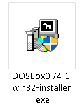
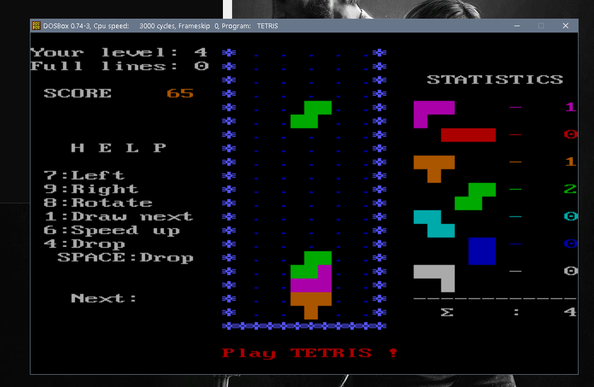
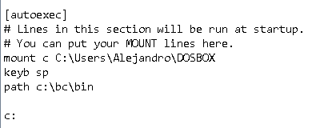
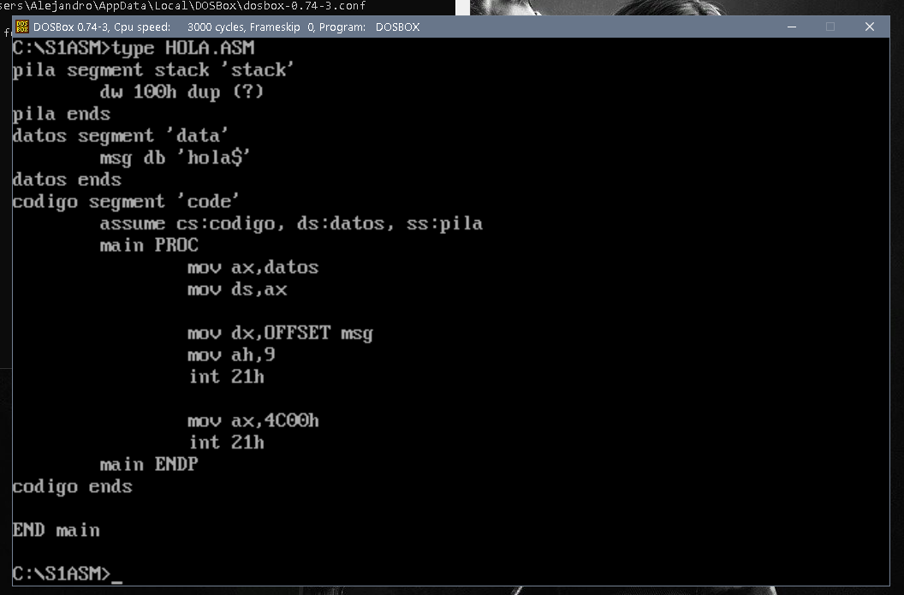
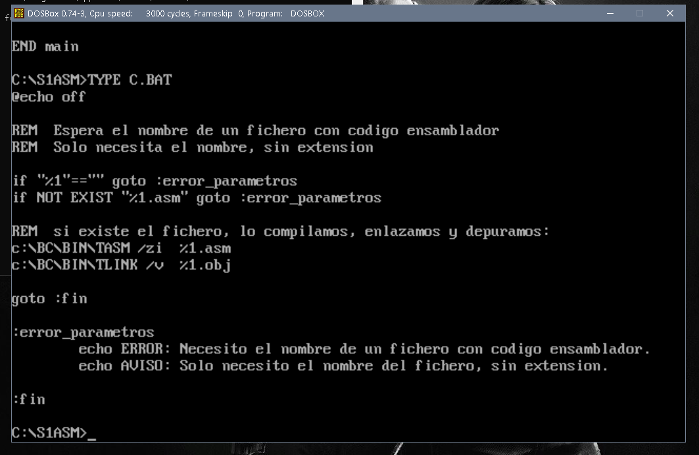
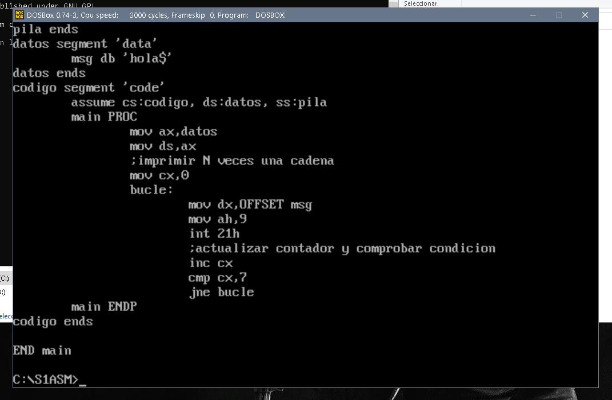
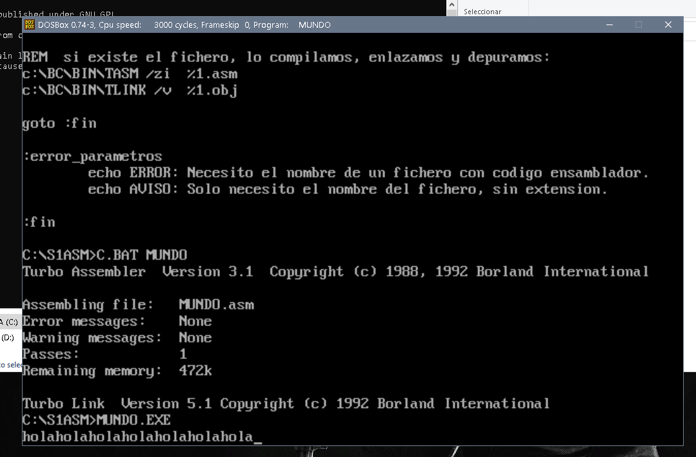

# SEMINARIO 1 - EJERCICIO:
### En este ejercicio del Seminario 1 se nos pide la realización de los siguientes apartados:
1. **Instalar el software DOSBOX** y ejecutar aplicaciones de MS-DOS 
2.  **Configurar el inicio de DOSBOX** para que monte en su unidad C: el directorio donde se 
encuentra el entorno de programación Borland C (BC) que incluye las herramientas para 
compilar no sólo lenguaje C, sino también ensamblador. Añadir a la variable “PATH” de 
inicio el directorio “bin” donde se encuentra el ejecutable BC.EXE
3. **Crear el ejemplo “Hola mundo” en ensamblador**, compilarlo y comprobar su 
funcionamiento. A continuación, modificar ese ejemplo para incluir un bucle que muestre 
ese mensaje 7 veces.
### Todo ello cumplimentado con capturas de pantalla.
--------------------------------------------------------
## ***1.Instalar el software DOSBOX y ejecutar aplicaciones de MS-DOS***
### Bien, esta parte sencilla, el profesor nos proporciona el .exe para instalar el programa.

### Ejecutamos el exe y seleccionamos la carpeta en donde queremos (recomendado que sea una ruta fácil y accesible, en mi caso ha sido en el C/DOSBox-0.74-3).
### Con todo listo puedes abrir el acceso directo que te habrá generado y probar los juegos. 
### Los juegos que yo he probado nos los proporcionó el profesor.
## **TETRIS:**

## **VBALL:**

--------------------------------------------------------
## ***2. Configurar el inicio de DOSBOX.***
### Para configurar DOSBOX primero que nada debemos tenerlo instalado, y acto seguido tendremos un archivo de configuración de DOSBOX en nuetro SO, dependiendo de en qué SO estemos, se localizará en una carpeta especifica.
- **Windows:**  C:\Users\username\AppData\Local\DOSBox\dosbox-0.74.conf
- **Linux:** ~/.dosbox/dosbox-0.74.conf
- **MacOs:** /Users/username/Library/Preferences/DOSBox_0.74-3-3_Preferences
### Yo como tengo Windows mi archivo se localiza aqui: C:\Users\Alejandro\AppData\Local\DOSBox

### Bien, localizado el archivo procedemos a abrirlo y nos vamos al final del todo del mísmo, a la parte donde estan las líenas que dicen: 
### <center> *[autoexec]* </center>
### <center> *Lines in this section will be run at startup.* </center>
### <center> *You can put your MOUNT lines here.* </center>
### Pues justo debajo de esas 3 líneas, escribimos las que necesitamos para configurar DOSBOX:
1. **Montar el disco C:** mount c C:\Users\Alejandro\DOSBOX
2. **Poner el teclado en Español:** keyb sp
2. **Indicar las utilidades de compilación del Path:** path c:\bc\bin
### El resultado que debe quedar es el siguiente:

### Al iniciar DOSBOX, si todo ha ido correctamente nos mostrará lo siguiente:

*Si no saliese así comprueba si has configurado bien el archivo.*
--------------------------------------------------------
## ***3.Crear el ejemplo “Hola mundo” en ensamblador***
### En esta parte se nos pide crear en esamblado el programa "Hola Mundo", siguiendo el guión del Seminario 1 llamado Bajo Nivel, se puede crear el programa de forma correcta.
### El código de dicho programa queda tal que así:
### ***hola.asm***
```
pila segment stack 'stack'
	dw 100h dup (?)
pila ends
datos segment 'data'
	msg db 'hola$'
datos ends
codigo segment 'code'
	assume cs:codigo, ds:datos, ss:pila
	main PROC
		mov ax,datos
		mov ds,ax

		mov dx,OFFSET msg
		mov ah,9
		int 21h

		mov ax,4C00h
		int 21h
	main ENDP
codigo ends

END main
```
### Bien, teniendo ya el código pasamos a compilarlo y enlazarlo en DOSBOX.

### Para hacerlo más simple y fácil usamos el script.BAT para compilarlo.

### Hacemos C.BAT {nombre del programa a compilar}
`C.BAT HOLA`
### Acto seguido ejecutamos el .EXE y nos mostrará el mensaje.
`HOLA.EXE`

### Vemos que el resultado que da al ejecutar el .EXE es mostrar el mensaje que dice: "hola".
<br>

### Ahora nos piden que modifiquemos el programa para que muestre en bucle el mensaje 7 veces. 
### La diferencia entre éste programa y el otro es que hay que añadir un registroa que nos sirva como un contador y comprobar la condición de bucle.
### El código de dicho programa queda tal que así:
### ***mundo.asm***
```
pila segment stack 'stack'
	dw 100h dup (?)
pila ends
datos segment 'data'
	msg db 'hola$'
datos ends
codigo segment 'code'
	assume cs:codigo, ds:datos, ss:pila
	main PROC
		mov ax,datos
		mov ds,ax
		;imprimir N veces una cadena
		mov cx,0
		bucle:
			mov dx,OFFSET msg
			mov ah,9
			int 21h
			;actualizar contador y comprobar condicion
			inc cx
			cmp cx,7
			jne bucle
	main ENDP
codigo ends

END main
```
### Bien, teniendo ya el código pasamos a compilarlo y enlazarlo en DOSBOX, que es básicamente igual que el anterior.
### En este caso yo he decidido hacerlo en otro archivo asm aparte para tener los 2 ejemplos por separado.

### Hacemos C.BAT {nombre del programa a compilar}
`C.BAT MUNDO`
### Acto seguido ejecutamos el .EXE y nos mostrará el mensaje.
`MUNDO.EXE`

### Vemos que el resultado que da al ejecutar el .EXE es mostrar el mensaje que dice: "hola" 7 veces seguidas.
